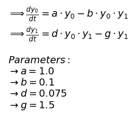

<h1 align="center">
    Welcome to <strong><strong>procmodeling!</strong></strong>
    <br>
    <span style="font-weight: normal; font-size: 16px;" >An easy way to solve and optimize your ODE system.</span>
</h1> 

## How to Solve Your ODE

**FIRST STEP:** Create a `.txt` file or a docstring variable containing the ODEs using Python equation syntax.


``` py title="edo_Lotka_Volterra.txt"
# Let's use the Lotka-Volterra ODEs where:
# y[0] = prey population
# y[1] = predator population
# dydt[0] = rate of change of prey over time
# dydt[1] = rate of change of predators over time

# Define the EDOs
dydt[0] = a * y[0] - b * y[0] * y[1]
dydt[1] = d * y[0] * y[1] - g * y[1]

# Define the parameters:
a = 1.0    # prey birth rate
b = 0.1    # predation rate
d = 0.075  # predator growth rate
g = 1.5    # predator death rate
```

!!! note annotate "Please note the following three rules:"

    1. The names `y`, `t`, and `dy/dt` are **reserved keywords** representing the dependent variables, time, and the ODE system, respectively;
    2. Both `y` and `dy/dt` are **vectors**, where `[i]` (`i` being an integer) indicates the index of the dependent variable;
    3. Respect Python’s equation syntax and make sure to define **all the variables** used in the system's equations. The order of expeditions does not matter.


**SECOND STEP:** Import and check your equations

```py linenums="1"
from procmodeling import solver
edo = solver.edo_functions('edo_Lotka_Volterra.txt')
```

??? Example "Example Output"
    ```text
    edo_functions: Document was read
    ```
    
    

**THIRD STEP:** Call the solve method after setting the time span and initial conditions

```py linenums="1"
edo.solve( t_span=[0,15], y0=[40, 10] )
```

??? example "Example Output"
    


## How to Optimize Your EDO

**FIRST STEP:** After successfully solving your ODE, organize the data (which will be used for parameter fitting) into a DataFrame following the format below:


| Initial Conditions |             |            |              | Time   | Conditions at time = j |             |            |             |
|--------------------|-------------|------------|--------------|--------|------------------------|-------------|------------|-------------|
| **$y_0[1]$**       | **$y_0[1]$**| **\.\.\.** | **$y_0[j]$** | **t**  | **$y[0]$**             | **$y[1]$**  | **\.\.\.** | **$y[j]$**  |
| y0\[0\]\(i\)       | y0\[1\]\(i\)| \.\.\.     | y0\[j\]\(i\) | j      | y\[0\]\(i\)            | y\[1\]\(i\) | \.\.\.     | y\[j\]\(i\) |
| \.\.\.             | \.\.\.      | \.\.\.     | \.\.\.       | \.\.\. | \.\.\.                 | \.\.\.      | \.\.\.     | \.\.\.      |

!!! note annotate
    This structure allows you to fit your ODE model using multiple initial conditions if needed.


**SECOND STEP:** Define the search space for the parameters and call the optimizer

```py linenums="1"
bounds = {
    'param1': (min, max),
    'param2': (min, max),
    ...
    }

initial_conditions_columns = ['y0[0]', 'y0[1]', ... ]

edo.optimize(
    data = generated_data,
    initial_values_columns = initial_conditions_columns,
    target_values_columns = ['y[0]', 'y[1]', ...],
    time_column = 'time',
    bounds = bounds
)
```

!!! note
    An example of optimizing the Lotka-Volterra ODE is available [here](https://github.com/tenoriolms/procmodeling_lib/tree/main/docs/examples/lotka_volterra_optimization.ipynb)
    